# React Conf 2025

## はじめに

10/7/2025 ~ 10/8/2025 にかけて開催された React Conf 2025 に招待を受け、参加してきた。
React Conf は Meta 社と callstack 社が主催する、React に関するカンファレンスである。

今回は、その内容を振り返り、特に印象に残ったセッションについてまとめる。

## Day 1

### Introduction

React Conf 2025 のはじまりは、 Seth Webster 氏の挨拶から始まった。
短い挨拶だったが、その中で彼は React の素晴らしさはただのライブラリではなくコミュニティの大きさにあると語った。

私も同意見で、 React はそれ自体が素晴らしいライブラリであることは間違いないが、それ以上に Web やそれ以外のプラットフォーム開発に対する人々の考え方を大きく変えたことが重要だと思う。

### React Keynote

React Keynote は、 React core team のメンバーたちが登壇し、 React 19.2 の新機能をおさらいし、 canary release に新しく乗る予定の機能について紹介した。

まずは Joe Savona 氏が登場し、Suepsense の Sibling pre warming や React Server Components を例にとり、 React のアップデートにはたくさんのコミュニティのフィードバックが反映されていることを強調し、感謝の意を述べた。

その後、 AI との向き合い方について語っていたのが個人的に印象的だった。
人間にとって使いやすい体験は、 AI にとっても使いやすい体験であるべきであり、React core team は常に、誰もが簡単に素晴らしいユーザー体験を提供できるようにすることを目指している。
この考えを総括するスライドとして「Responsive User Experiences」でまとめられていたのが印象的だった。
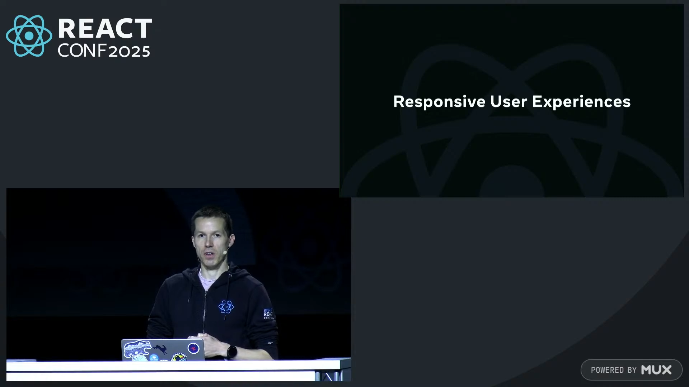

続いて、 Mofei Zhang 氏が登壇し、 React 19.2 の新機能について紹介した。
今回の変更で様々な魅力的な機能が多く追加されたが、中でも彼女は `<Activity />` コンポーネントの奥深さについて語っていた。
彼女は、コミュニティがこのコンポーネントを単にアプリケーションの可視状態を制御するためのものとしか捉えていないことに懸念を示していた。
実際は React Fiber のスケジューリング機構と密接に関連していて、`mode='hidden'` な子要素に関しては最低優先度のレーンに分類され SSR はされず、 re-hydration もされない。
一方で三項演算子などで表示制御をしているものと違い、 React は DOM の構造と状態を保持し、そのコンポーネントに関連する副作用はアンマウントされたままになる。
この違いは、変更が commit されてからそれを実際の DOM に反映されるまでの間に、非可視状態のコンポーネントにも関わる副作用が発生する場合に重要となる。
commit に反応する時間は、どちらも同じであるため INP は同じになるが、FID は大きく異なる可能性がある。

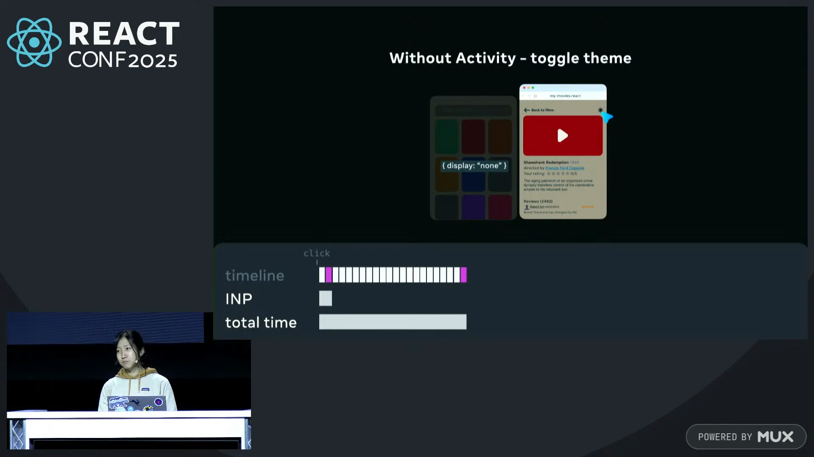

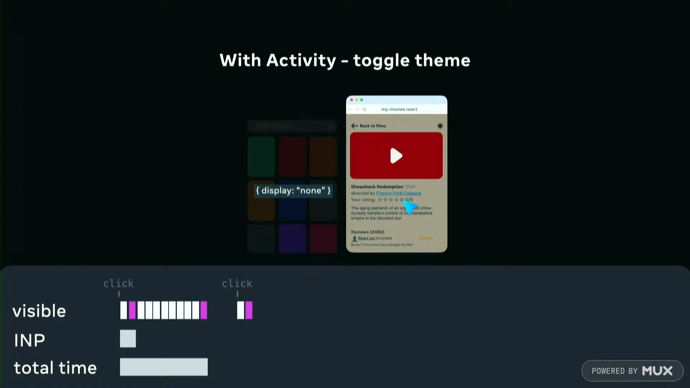

続いて、Jack Pope 氏が登場し、 React core team が今取り組んでいるプロジェクトについて紹介した。
React には私達アプリケーション開発者が使用する stable release の他に、experimental release と canary release が存在する。
jack 氏は、React に関するライブラリを開発している人にはぜひとも canary release の変更を追いかけてほしいと語った。
canary release は、 React core team が次に stable release に乗せる予定の機能をいち早く試すことができるリリースであり、今回新しく以下の機能が追加された。

- View Transition
- Fragment refs

View Transition は Web API の 1 つにあり、 React でも `flushSync` を用いることで使用はできた。
しかし、同期的な更新するため並行レンダリングとは相性が悪かった。
今回の canary release に乗った ViewTransition コンポーネントは、遅延処理と Suspense をトリガーとしてヒューリスティックにアニメーションする要素を決定することで、並行レンダリングと相性の良い形で View Transition を実現している。

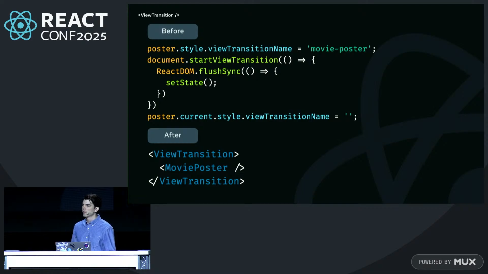

Fragment refs は、 Fragment に ref を渡せるようにする機能である。
これまで、Web API をコンポーネントが扱う場合、カスタムフックや render prop を用いたり、ref を正しい位置で取得するために子要素の周りに別の div 要素を追加したりする必要があった。
Fragment refs を用いることで、これらの問題を解決できるようになる。

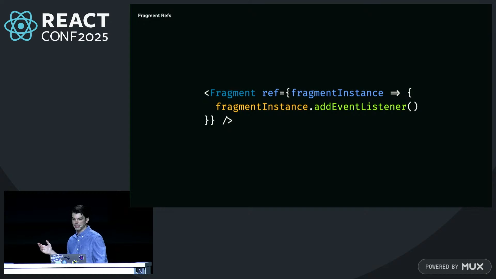

この `FragmentInstance` には以下のように blur や addEventListener などのメソッドが存在する。

https://github.com/DefinitelyTyped/DefinitelyTyped/blob/2b34e30eb8ea7bd37fbed3b32eaabfdb4d23f678/types/react-dom/canary.d.ts#L49-L69

また Jack 氏は、デザインシステムなどのすでに DOM 構造が決まっていて、かつ ref を props として受け付けないコンポーネントと対話する際に、 Fragment refs が役立つと語った。

次に Lauren Tan 氏が登壇し、 React Compiler の現在地について紹介した。
React Compiler v1 が発表された！！！！
React Compiler の構想が発表された日から常に注目していたため、非常に嬉しい発表だった。

去年の React Conf で Lauren 氏は Bluesky に対して React Compiler を導入するデモを行っていた。
その中で、Bluesky が React Compiler を導入した初めてのプロジェクトであると語っており、Facebook や Instagram で先に導入されるのではないかと予想していたため、意外だった。

続いて、 `eslint-plugin-react-hooks` の新しいルールについて紹介された。
React Compiler の解析基盤の恩恵を受けることで、これまで検査が難解だった React の hooks やライフタイム、コンポーネントのレンダリングに関する新しいルールが追加された。

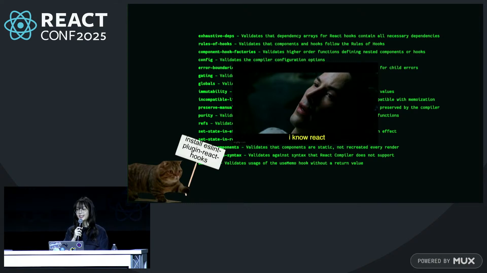

また、 Lauren 氏は発表の最後に「React Compiler teaches best practices」と語った。
これはとても重要なことで、 React Compiler は単にコードを最適化するだけでなく、開発者がより良いコードを書く手助けをすることも目指している。
React Compiler は将来的な React の基盤になる、そう強く感じた。

ここからは私の戯言だが、React Compiler は現状 babel プラグインとして提供されており、実態としては babel AST を始めとした babel runtime に強く依存している。
そのため、昨今話題になる Rust 製の高速なコンパイラ基盤を用いた技術との親和性が低いと感じている。
技術の民主化が進む中で、より多くの人々がコンパイラ技術の恩恵を受けるためには、 React Compiler 自体もより多くの基盤で動作することが望ましいと考えている。

また、私が個人的に恐れているのは React Compiler と TypeScript Compiler が同じで、挙動が唯一の仕様になっていて、ドキュメントとしての仕様が存在しないことだ。
これは、先程の技術の民主化の観点からも問題があると考えている。
長らくの間 TypeScript Compiler の別言語による再実装は試みられたが、互換性を保つことが難しく、最終的には Microsoft 自身が人を投入し別言語による再実装した。
React Compiler も同様の問題に直面する可能性があると考えている。
これについて、実際に Joe Savona 氏へ質問する機会があったため、彼の回答を以下に引用する。

> About formalization of the compiler — we're still iterating substantially on the core of the compiler and the kinds of things that we're building on top of it. For example, all the stuff we built for Forest and Fir that isn't OSS yet, plus more external experiments we didn't even have time to get into
>
> With complicated systems like the compiler (and TypeScript) it really does not make sense to have multiple implementations. The language spec is the shared, formalized thing. That's what lets the community build incredible tooling around it.
>
> So the path for things like biome or oxlint is that we should wrap the existing compiler in a lightweight Rust plugin that just executes the JS version

複雑なシステムにおいて複数実装は意味をなさず、言語仕様こそが共有され形式化された基盤であるべき、というのは私も同意見だ。
この意見を踏まえて考えてみると、 React Compiler と同時に eslint rules も新たに開発されたのは、静的解析という手段で私達に React core team が考える React のベストプラクティスを伝えたい、という意図があるのかもしれない。

最後に再度 Seth Webster 氏が登壇し、React Foundation の設立を発表した。
React のエコシステム・コミュニティの成長を受けて、Meta に依存しない運営体制への移行が望まれていたことを受け、Meta の管理下から切り離す形で React Foundation を設立することになった。

一方で、テクニカルガバナンスについては、React に実際に関与するコントリビュータが主体となって決定すべきと考えており、 React Foundation とは別の独立した技術的ガバナンス構造を設計することを目指している。
これは、React Foundation に参加している特定の企業が React の技術的方向性に過度に影響を与えることを防ぐためである。

日本ではこの発表を受けて、React が Meta の手から離れてメンテナンスモードになるのではみたいな意見が散見されたが、誤解である。
React Foundation の設立は、React のエコシステムの成長と持続可能性を支援するためのものであり、React 自体の開発が止まるわけではない。
むしろ、React Foundation の設立により、React のエコシステムはより健全で持続可能なものになることが期待されている。

### Profiling with React Performance tracks

このセッションでは、React core team の Ruslan Lesiutin 氏が登壇し、React Performance tracks を紹介した。
内容としては、ライブデモを交えながら、 React Performance tracks の使い方やその利点について説明していた。
特に自分が興味深かったのは、今年の後半にリリース予定の Suspense boundary をデバッグする機能についての紹介だった。
この機能は、特定の Suspense が停止した理由を確認できるもので、 Suspense の中で発生したエラーや、データのフェッチが完了しなかった場合などに役立つ。
また、Suspense boundary そのものを可視化する機能も追加される予定で、適切な Suspense boundary の設計に役立つと考えられる。

### Async React

このセッションでは、React core team の Ricky Hanlon 氏が登壇し、 React の未来について語った。
個人的に一番印象に残ったセッションで、 React の未来に対する彼のビジョンが非常に明確で、かつ実現可能なものであると感じた。
React core team は 10 年以上にわたり、"reconciler with yielding event loop" に取り組んでおり、その 1 つの答えが concurrent rendering であると語った。
この概念は React 18 で導入された transition を良い感じに扱う仕組みがその一例である。
しかしコミュニティでは transition がレンダリングパフォーマンスを改善するための 1 回限りの機能であると捉えられているが、そうではない。
React core team は、アプリケーションの応答性を向上するには、ユーザーが行うすべての操作を非同期に処理する必要があると考えている。

有名な `ui = f(state)` という React のメンタルモデルは現代のアプリケーションには適していないと彼は語った。
なぜなら、ユーザーが行うすべての操作を同期的に処理するのは不可能であり、またそれがユーザー体験を損なう可能性があるからだ。
このセッションでは `await ui = await f(await state)` という新しいメンタルモデルを提案している。
これは、ユーザーのイベント、それに応じた状態の更新、そしてそれに基づく UI の更新がすべて非同期であることを示している。

Async React の目指す先は、ユーザーの環境にスケールして体験を悪化させずに機能させることができる、ということだ。
ネットワークボトルネックを様々な状態でローディングを示すことで体験を悪化させなくて良くなり、低スペックなデバイスでも快適に動作するようになる。
この核心は transition にあり、ユーザーの操作を優先し、その他の更新を遅延させることで、アプリケーションの応答性を向上させることができると語った。

そのために Ricky 氏は次のような考え方が必要だと語った。

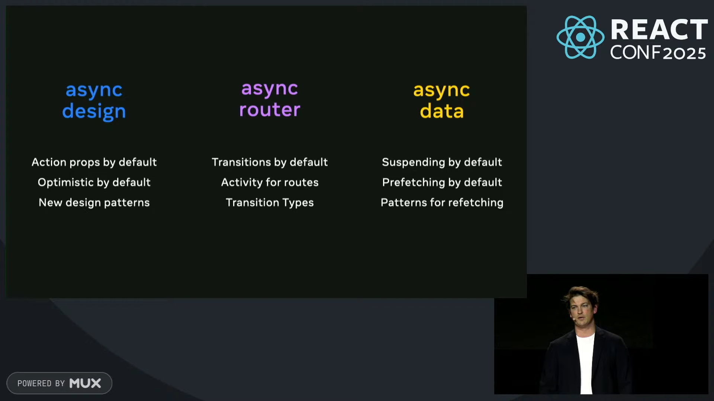

また、 Async React は今回 working group が新しく立ち上げられたため、興味がある人は参加してほしいと語った。[^1]

[^1]: [reactwg/async-react](https://github.com/reactwg/async-react)

### Exploring React Performance

このセッションでは再び Joe Savona 氏が登壇し、 巷で話題の React のレンダリングパフォーマンスについて、どれくらい優れているかを論じた。
React のレンダリングパフォーマンスについて正しく理解するためには、React の増分計算について理解する必要があったと語った。
その中で見えてきたのは、増分計算を用いたレンダリングパフォーマンスの向上には次の 2 つの要素が重要であるということだった。

- data model
- update algorithm

update algorithm については、React Compiler や concurrent rendering など、 React core team がこれまでに取り組んできたことが大きく貢献している。
React Compiler はコンポーネントをより小さいロジックに分割しているため、変更があった場合に再計算する必要がある部分を最小限に抑えることができる。
また、変更される可能性のある state を統括的に管理した data model をすることで、変更があった場合に影響を受ける部分を特定しやすくなっている。
Joe 氏は単一の状態を context 経由で管理することが、 React のレンダリングパフォーマンスを向上させるために重要であると語った。

話は変わって、界隈で話題な signal base の state management についても言及があった。
React core team は React Forest という名前の runtime based で signal based な遅延評価される computation graph を prototype として開発した。
そして実際に signal base の state management は React のレンダリングパフォーマンスを向上させるのかを検証した。

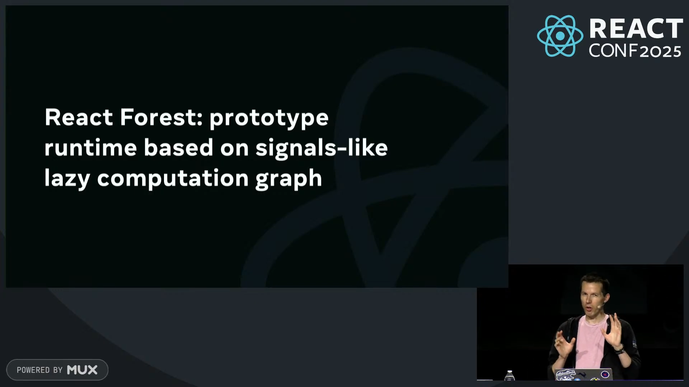

しかし、検証の結果、 signal base の state management は React のレンダリングパフォーマンスを向上させるわけではない、という結論に至った。
この検証で大事なのは前提として、単一の状態を context 経由で管理するというデータモデルにおいて検証が行われた、ということだ。
この前提において、 signal base の state management はノードを 2 度舐めることになり、結果としてパフォーマンスは低下することが分かった。

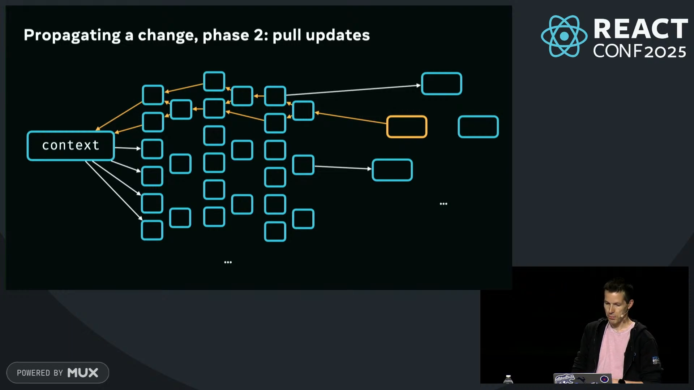

Joe 氏は、この結論や Meta にすでにある他の増分計算アルゴリズムを用いたシステム(Flow や Relay)を踏まえ、ドメイン固有なアプローチが一般化された増分計算アルゴリズムよりも優れていると語った。
そこで React core team は、全く新しいレンダリングのアイデアとして React Fir を紹介した。

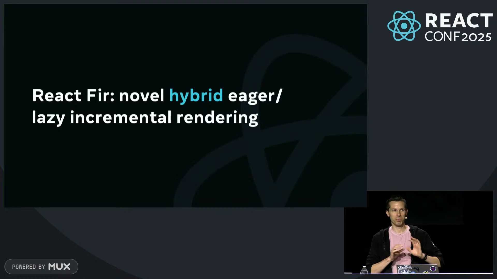

React Fir は、 React のレンダリングを完全に再設計することを目指しており、現在はまだ初期段階にありこれ以上の詳細は明らかにされていない。
私も実際アフターパーティーで Joe 氏に質問したが、まだ詳細は明らかにできないと語っていた。

話を戻して、現状の React runtime と React Compiler を用いて、これ以上レンダリングパフォーマンスを向上させるためにはどうすれば良いか、という話になった。
Joe 氏は、 data mdoel に着目することが重要であると語った。
鍵となるのは細かい、state の変更の監視ができる store を用いることだ。
次のような store を用いることで、変更があった場合に影響を受ける部分を特定しやすくなる。

```ts:sample.ts
type Store<T> = {
	get(key: string): T;
	subscribe(key: string, cb: (value: T) => void): Disposable;
	update(key: string, value: T): void;
};
```

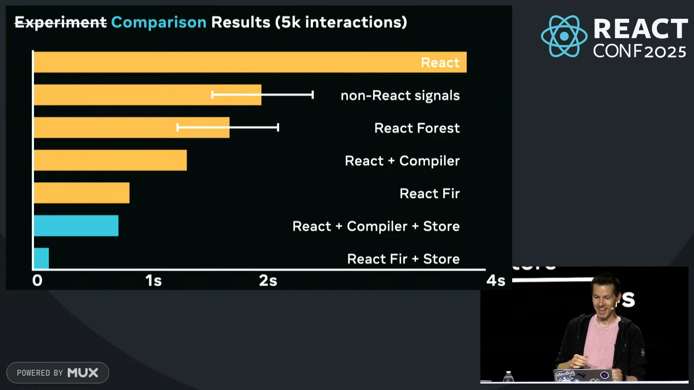

Joe 氏は、こういったデータモデルの見直しを行うことで、 React のレンダリングパフォーマンスをさらに向上させることができると語った。

結びに、今の React にて非常に優れたレンダリングパフォーマンスを得るためには、以下の 2 つが重要であると語った。

- React が提供しているすべてのパフォーマンス機能を正しく使う
- アプリケーションの使用しているデータモデルを検討する

また Future React として、 concurrent store for targeted updates についてサポートする可能性を示唆した。

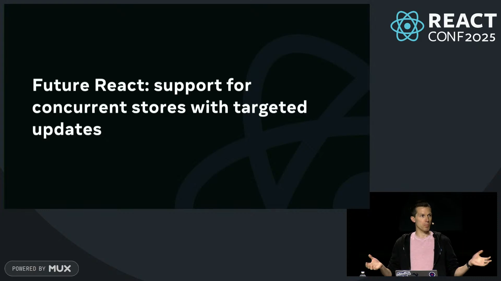

### React team Q&A

一日目の最後は React core team のメンバーが登壇し、参加者からの質問に答える Q&A セッションだった。
個人的に印象に残った質問をいくつか紹介する。

- React Compiler を導入していく上で手動の memo 化を消す必要はあるのか？また、 `useMemo` や `useCallback` は将来的に廃止されるのか？
  - 全くその必要はないし、将来的に廃止される予定も今のところない
  - React Compiler は手動の memoization を自動化することを目指しているが、すべてのケースをカバーできるわけではない
  - また、メモ化を行うこれらの API は、React Compiler のメモ化のための推論のヒューリスティックの一部になっている
- React Compiler を本番導入できない意見の中で気づいたことは？
  - コミュニティの Rust based な基盤に移行しているが、React Compiler はその流れに現状は乗れていない
  - 鍵となるのは Static Hermes の AOT コンパイル
    - まだ実験段階だが、AOT コンパイルした Native Code を Rust 製の基盤で動かすことができるようにしたい
    - これが上手くいかなかった場合は、React Compiler 自体をよりポータビリティの高いものにする必要がある
- React Foundation によって React と Meta の関係は変わる？
  - 変わらず投資は続く
  - React Foundation 発足前から React に対して企業は口を出していた
  - React Foundation はその口を出せる窓口を広げたものでしかない

## Day 2

先に謝りを入れると、 Day 2 は React Native に関するセッションが多く、私の専門外の内容が多かったため、まとめることができなかった。
私の力不足で申し訳ないが、アーカイブを視聴するとともに、他の方が書いた記事を読むことをお勧めする。

### React Native Keynote

2 日目の最初は、 React Native core team のメンバーたちが登壇し、 React Native の現在地と未来について紹介した。

中でも印象的だったのはサポートする Web API の拡充と、Hermes v1 の話だった。
今回リリースされた React native 0.82 には、多くの DOM API が追加されており、より Web に近い形で React Native を使用できるようになった。

また年末にリリース予定の React Native 0.83 では、Web Performance API のサポートが追加される予定で、UX の潜在的なボトルネックである表示応答性を測定できるようになるとのことだった。

Hermes v1 は、待望の Static Hermes の正式リリースであり、これは React Native のバンドルサイズを大幅に削減することが期待されている。
また Hermes v1 は待望の ES6 構文のサポートが含まれており、今まで必要だった Polyfill の多くが不要になる。

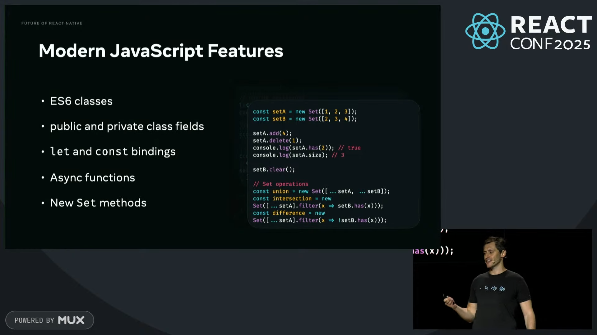

### React Strict DOM

このセッションでは、Meta 社の Nicolas Gallagher 氏が登壇し、 React Strict DOM について話した。
まず始めに、 Nicolas 氏は React の複雑性について語った。
特にスタイリングに関する複雑性は、 React のエコシステムの中で最も顕著な問題の 1 つであると語った。
この複雑性は結果としてコード間に不整合が生じ、移植可能なコードが少なくなることに繋がっている。
React と React Native の技術的な断片化はコミュニティの断片化の原因となるため、これを解決することが重要であると語った。

React Native for Web というプロジェクトがある。
これは React Native のコンポーネントを Web 上で動作させるための発想であり、React Native のインターフェースを Web に持ち込むことで、コードの移植性を高めることを目指していた。
しかし、 React Native のインターフェース自体が Web に最適化されていなかったため、大きなマインドセットの変更を伴うことになり、コミュニティの断片化を解決するには至らなかった。
そこで React Native team は、一度は非現実的だと切り捨てた Web のインターフェースを React Native に持ち込むことを決断した。
これが React Strict DOM である。
私が特に印象に残ったのは、React Strict DOM の StyleSheet API のインターフェースを見たときだった。
最初に React Strict DOM の StyleSheet API を見たとき、私はそれが StyleX に類似していると感じた。
その後の説明では codemod 一発で Web のコードも React Strict DOM に移行できると語っていたのだが、その移行前のサンプルコードが StyleX で書かれたのだ。
これは大きな伏線回収であると同時に Meta 社があらゆる技術を俯瞰して大きな目的を達成しようとしていることを感じた。

## おわりに

React Conf 2025 は、 React の現在地と未来を知る上で非常に有意義なカンファレンスだった。
特に印象に残ったのは、 React Compiler の v1 リリースと Async React のビジョンだった。
React Compiler は私達が React を使う上で非常に重要な技術であり、これからの React の基盤になると強く感じた。
また Async React のビジョンは、私達が React を使う上でのメンタルモデルを大きく変える可能性があると感じた。
React core team は常に私達のフィードバックを求めており、私達も積極的に参加していくべきだと感じた。
今回の React Conf 2025 に参加できたことを非常に嬉しく思うとともに、 React の未来に対する期待が高まった。
